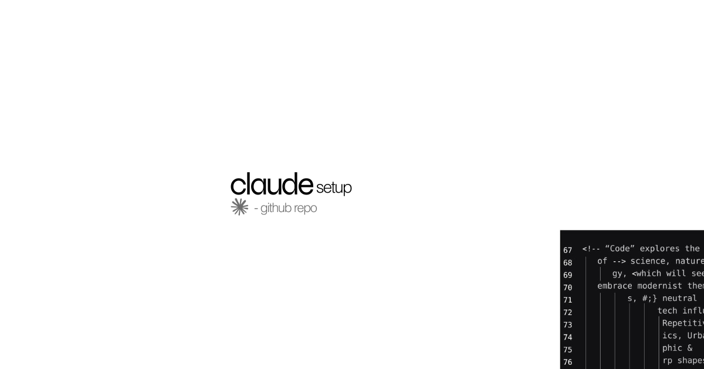

<div align="center">


# Claude Setup

### Ton business dans la tête de Claude Code, en moins de 5 minutes.



Un dossier que Claude relit à chaque session : ton profil, ta stack,<br>tes projets, ta mémoire. Tourne en local, s'installe en une commande,<br>et se souvient de toi à la session d'après.

<br>

<a href="https://rayuqi.xyz">

</a>

<br><br>

<a href="https://x.com/rayuqi_"></a>
<a href="https://youtube.com/@rayuqi"></a>
<a href="https://tiktok.com/@rayuqi_"></a>
<a href="https://instagram.com/rayuqi_"></a>
<a href="https://github.com/junudah"></a>

<br>

<sub>Skill conversationnel · Second Cerveau · mémoire automatique · skills Anthropic · 32 sub-agents · Playwright CLI + opencli · 100 % local, zéro serveur</sub>

</div>

---

`claude-setup` est un skill conversationnel qui fait à ta place tout ce qu'il faut configurer après avoir installé Claude Code : Second Cerveau, CLIs, skills, sub-agents, automatisation navigateur et clé API. Une commande, ~6 questions, et Claude connaît ton business dès la première phrase.

## Quick start

```bash
bash <(curl -fsSL https://raw.githubusercontent.com/junudah/claude-setup/main/install.sh)
```

Le script va :

1. Détecter ton OS, ton shell et ce qui est déjà installé.
2. Initialiser ton Second Cerveau à `~/second-brain/`.
3. Installer les CLIs manquants (Claude Code, jq).
4. Cloner [`anthropics/skills`](https://github.com/anthropics/skills) et [`msitarzewski/agency-agents`](https://github.com/msitarzewski/agency-agents).
5. Installer l'automatisation navigateur : **Playwright CLI** + **opencli** (aucun MCP).
6. Ranger ta clé Anthropic dans `~/second-brain/00-system/secrets/keystore.env` (chmod 600).
7. Créer ton agent perso avec son `soul.md`.

Relançable autant de fois que tu veux : ce qui existe est préservé.

### Ou via Claude Code

Colle cette URL dans Claude Code, il lit `SKILL.md` et te pose les questions lui-même :

```
https://github.com/junudah/claude-setup.git
```

---

## What's included

| Composant | Source | Destination |
|-----------|--------|-------------|
| Second Cerveau | Templates locaux | `~/second-brain/` |
| Mémoire automatique (hook Stop) | `hooks/memory-logger.py` | `~/second-brain/memory/log.md` |
| Skills officiels Anthropic | [`anthropics/skills`](https://github.com/anthropics/skills) | `~/second-brain/skills/anthropics/` |
| 32 sub-agents Agency | [`msitarzewski/agency-agents`](https://github.com/msitarzewski/agency-agents) | `~/.claude/agents/` |
| Playwright CLI | `playwright` (npm) + Chromium | `playwright` dans le PATH |
| opencli | `@jackwener/opencli` (npm) | `opencli` dans le PATH |
| Claude Code CLI | `@anthropic-ai/claude-code` | `claude` dans le PATH |
| Clé API Anthropic | prompt | `~/second-brain/00-system/secrets/keystore.env` (chmod 600) |
| Agent perso | Template `soul.md` | `~/second-brain/agents/<id>/soul.md` |

### Pourquoi pas le MCP Playwright

Deux CLIs à la place d'un serveur MCP, pour trois raisons :

- **Zéro token à l'exécution** — un MCP charge ses définitions d'outils dans le contexte à chaque session ; une CLI ne coûte rien tant que l'agent ne l'appelle pas.
- **`opencli` passe par ton Chrome déjà connecté** — pas de re-login, pas de session à maintenir pour Instagram, X ou GitHub.
- **Ça se débugge à la main** — tu lances la commande dans ton terminal et tu vois exactement ce que l'agent voit.

```bash
playwright screenshot https://example.com shot.png   # navigateur pilotable, headless
opencli instagram profile rayuqi_ --format json      # 100+ sites via ta session Chrome
```

---

## Architecture

```
┌─────────────────────────────────────────────────────────────┐
│                     Claude Code Session                      │
│                                                              │
│   ┌────────────┐   ┌────────────┐   ┌──────────────────┐   │
│   │   Skills   │   │ Sub-agents │   │  Browser CLIs    │   │
│   │ ~/.claude/ │   │ ~/.claude/ │   │   playwright     │   │
│   │   skills   │   │   agents   │   │   opencli        │   │
│   └────────────┘   └────────────┘   └──────────────────┘   │
│         │                │                    │              │
│         └────────────────┴────────────────────┘              │
│                          │                                   │
│                          ▼                                   │
│            ┌────────────────────────────┐                   │
│            │       Second Cerveau       │                   │
│            │      ~/second-brain/       │                   │
│            │  user.md   environment.md  │                   │
│            │  01-identity/  02-goals/   │                   │
│            │  10-projects/  memory/     │                   │
│            └────────────────────────────┘                   │
└─────────────────────────────────────────────────────────────┘
```

Détail : [`docs/ARCHITECTURE.md`](docs/ARCHITECTURE.md).

---

## Structure créée

```
~/second-brain/
├── CLAUDE.md          ← point d'entrée (relu à chaque session)
├── user.md            ← ton profil business
├── environment.md     ← ta stack et tes chemins
├── 01-identity/       ← profil.md, voix.md
├── 02-goals/          ← objectifs.md
├── 03-business/       ← dossiers selon ton profil (lancement / e-com / scaling)
├── 10-projects/       ← un dossier par projet
├── agents/            ← ton agent perso et son soul.md
├── skills/            ← anthropics/skills + agency-agents
├── hooks/             ← memory-logger.py
├── memory/            ← log.md, écrit tout seul en fin de session
├── inbox/  90-archive/
└── 00-system/secrets/ ← keystore.env (chmod 600, jamais commité)
```

---

## Personnalisation

Les questions posées pendant l'install :

- **Identité** — prénom, type de business, outils du quotidien.
- **Niveau Claude Code** — débutant / intermédiaire / avancé, pour calibrer le ton.
- **Profil** — lancement / e-com / scaling, ça décide de l'arborescence `03-business/`.
- **Agent perso** — nom et ton (formel / direct / cool), génère un `soul.md`.
- **Chemin** — `~/second-brain` par défaut, modifiable.

Tout est stocké en markdown dans `~/second-brain/`. Tu édites à la main quand tu veux.

---

## Après l'installation

```bash
cd ~/second-brain && claude
```

---

## Troubleshooting

Les cas courants sont dans [`docs/TROUBLESHOOTING.md`](docs/TROUBLESHOOTING.md) :

- `jq` absent → `brew install jq`, puis relance.
- `opencli` ne répond pas → `opencli init` et vérifie l'extension Chrome.
- Playwright ne trouve pas de navigateur → `playwright install chromium`.
- Le keystore n'est pas lu → ajoute-le à ton `~/.zshrc`.

---

## Idempotent by design

Relance `install.sh` autant de fois que tu veux :

- Les CLIs déjà installés sont skippés.
- Un Second Cerveau existant est préservé, jamais écrasé.
- Les repos de skills sont `pull`, pas re-clonés.
- Une clé déjà dans le keystore n'est pas redemandée.
- Un agent qui existe déjà garde son `soul.md`.

---

## Inspiré de

- [`anthropics/skills`](https://github.com/anthropics/skills) — les skills officiels.
- [`msitarzewski/agency-agents`](https://github.com/msitarzewski/agency-agents) — les 32 sub-agents.

## License

MIT — voir [`LICENSE`](LICENSE).
